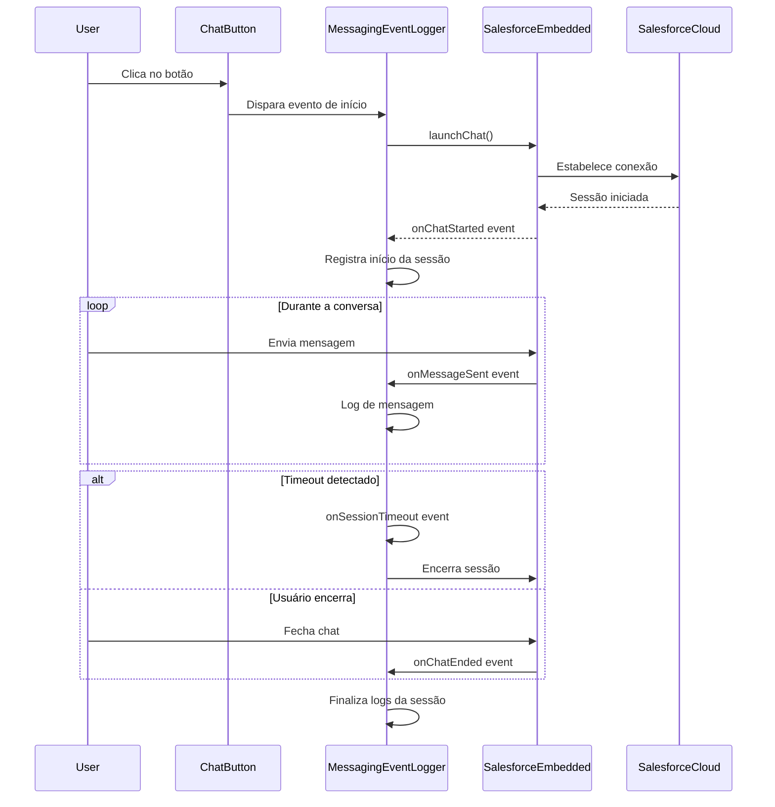

# MessagingEventLogger - Documentação

## 📋 Índice
- [Visão Geral](#visão-geral)
- [Arquitetura](#arquitetura)
- [Instalação](#instalação)
- [Configuração](#configuração)
- [Uso](#uso)
- [Eventos Monitorados](#eventos-monitorados)
- [API Reference](#api-reference)
- [Exemplos](#exemplos)
- [Troubleshooting](#troubleshooting)
- [Contribuindo](#contribuindo)

---

## 🎯 Visão Geral

O **MessagingEventLogger** é um componente de monitoramento e logging para o Salesforce Embedded Messaging implementado no site da Adium. Ele captura, registra e analisa eventos relacionados às interações de chat entre usuários e o sistema de mensagens.

### Funcionalidades Principais

- ✅ Monitoramento em tempo real de eventos de chat
- ✅ Registro detalhado de sessões de mensagens
- ✅ Análise de timeout de sessões
- ✅ Integração com Salesforce Embedded Messaging
- ✅ Logs estruturados para debugging e análise
- ✅ Suporte a múltiplos idiomas (pt_BR)

---

## 🏗️ Arquitetura

### Componentes do Sistema

```
┌─────────────────────────────────────────────────────────┐
│                    Frontend (HTML/CSS/JS)                │
│  ┌──────────────────────────────────────────────────┐  │
│  │           Botão de Chat Personalizado             │  │
│  │  - Balão de mensagem "Como posso ajudar?"        │  │
│  │  - Botão circular com logo Adium                 │  │
│  └──────────────────────────────────────────────────┘  │
│                          ↓                              │
│  ┌──────────────────────────────────────────────────┐  │
│  │        MessagingEventLogger (Core)                │  │
│  │  - Event Listeners                                │  │
│  │  - Session Manager                                │  │
│  │  - Timeout Handler                                │  │
│  │  - Logger Service                                 │  │
│  └──────────────────────────────────────────────────┘  │
│                          ↓                              │
│  ┌──────────────────────────────────────────────────┐  │
│  │    Salesforce Embedded Messaging Bootstrap       │  │
│  │  - embeddedservice_bootstrap.init()              │  │
│  │  - embeddedservice_bootstrap.utilAPI             │  │
│  └──────────────────────────────────────────────────┘  │
└─────────────────────────────────────────────────────────┘
                          ↓
┌─────────────────────────────────────────────────────────┐
│         Salesforce Service Cloud (Backend)              │
│  - Chat Agent Interface                                 │
│  - Message Queue                                        │
│  - Analytics & Reporting                                │
└─────────────────────────────────────────────────────────┘
```

### Fluxo de Eventos



---

## 📦 Instalação

### Pré-requisitos

- Conta Salesforce com Service Cloud habilitado
- Embedded Messaging configurado no Salesforce
- Site hospedado (GitHub Pages, servidor web, etc.)
- Navegador moderno com suporte a ES6+

### Passo 1: Configuração no Salesforce

1. Acesse o Salesforce Setup
2. Navegue para **Service Setup** → **Embedded Service Deployments**
3. Crie ou edite um deployment de Embedded Messaging
4. Anote as seguintes informações:
   - Organization ID (ex: `00DVA000001eH3B`)
   - Deployment Name (ex: `ChatAdium_GitHubPages`)
   - Site URL (ex: `https://adiumbr--devchatbot.sandbox.my.site.com/...`)
   - SCRT URL (ex: `https://adiumbr--devchatbot.sandbox.my.salesforce-scrt.com`)

### Passo 2: Adicionar Scripts ao HTML

```html
<!-- Scripts de Embedded Messaging do Salesforce -->
<script type='text/javascript'>
    function initEmbeddedMessaging() {
        try {
            embeddedservice_bootstrap.settings.language = 'pt_BR';
            embeddedservice_bootstrap.settings.displayHelpButton = false;
            embeddedservice_bootstrap.settings.chatButtonPosition = "-50000px,-50000px";
            
            embeddedservice_bootstrap.init(
                'SEU_ORG_ID',
                'SEU_DEPLOYMENT_NAME',
                'SUA_SITE_URL',
                {
                    scrt2URL: 'SUA_SCRT_URL'
                }
            );
        } catch (err) {
            console.error('Error loading Embedded Messaging: ', err);
        }
    }
</script>
<script type='text/javascript' 
        src='SUA_SITE_URL/assets/js/bootstrap.min.js' 
        onload='initEmbeddedMessaging()'>
</script>
```

### Passo 3: Adicionar Botão Personalizado

```html
<!-- Componente de botão de chat personalizado -->
<div class="botao-chat-container">
    <div id="chatBalloon" class="chat-balloon">Como posso ajudar?</div>
    <button id="botaoChat" class="botao-chat" onclick="iniciarChat()">
        
    </button>
</div>
```

---

## ⚙️ Configuração

### Configurações Básicas

```javascript
// Configuração do idioma
embeddedservice_bootstrap.settings.language = 'pt_BR';

// Ocultar botão padrão do Salesforce
embeddedservice_bootstrap.settings.displayHelpButton = false;

// Posicionar botão padrão fora da tela
embeddedservice_bootstrap.settings.chatButtonPosition = "-50000px,-50000px";
```

### Configurações Avançadas do MessagingEventLogger

```javascript
const messagingEventLoggerConfig = {
    // Tempo de timeout da sessão (em milissegundos)
    sessionTimeout: 300000, // 5 minutos
    
    // Habilitar logs detalhados
    enableVerboseLogging: true,
    
    // Enviar logs para servidor externo
    externalLoggingEndpoint: 'https://seu-servidor.com/api/logs',
    
    // Eventos a serem monitorados
    eventsToTrack: [
        'chatStarted',
        'chatEnded',
        'messageSent',
        'messageReceived',
        'sessionTimeout',
        'connectionError'
    ],
    
    // Callback personalizado para eventos
    onEventLogged: function(event) {
        console.log('Evento registrado:', event);
    }
};
```

---

## 🚀 Uso

### Inicialização Básica

```javascript
function iniciarChat() {
    // Ocultar balão de ajuda
    const balao = document.getElementById('chatBalloon');
    if (balao) balao.classList.add('hidden');
    
    // Iniciar chat
    embeddedservice_bootstrap.utilAPI.launchChat()
        .then(() => {
            console.log('Chat iniciado com sucesso');
            // MessagingEventLogger registra automaticamente
        })
        .catch((erro) => {
            console.error('Erro ao iniciar chat:', erro);
            alert('Não foi possível iniciar o chat no momento. Tente novamente mais tarde.');
            if (balao) balao.classList.remove('hidden');
        });
}
```

### Implementação Completa do MessagingEventLogger

```javascript
class MessagingEventLogger {
    constructor(config = {}) {
        this.config = {
            sessionTimeout: config.sessionTimeout || 300000,
            enableVerboseLogging: config.enableVerboseLogging || false,
            ...config
        };
        
        this.sessionId = null;
        this.sessionStartTime = null;
        this.messageCount = 0;
        this.events = [];
        
        this.init();
    }
    
    init() {
        this.attachEventListeners();
        this.startTimeoutMonitor();
    }
    
    attachEventListeners() {
        // Listener para início de chat
        window.addEventListener('embeddedMessaging:chatStarted', (e) => {
            this.handleChatStarted(e);
        });
        
        // Listener para fim de chat
        window.addEventListener('embeddedMessaging:chatEnded', (e) => {
            this.handleChatEnded(e);
        });
        
        // Listener para mensagens enviadas
        window.addEventListener('embeddedMessaging:messageSent', (e) => {
            this.handleMessageSent(e);
        });
        
        // Listener para mensagens recebidas
        window.addEventListener('embeddedMessaging:messageReceived', (e) => {
            this.handleMessageReceived(e);
        });
    }
    
    handleChatStarted(event) {
        this.sessionId = this.generateSessionId();
        this.sessionStartTime = new Date();
        this.messageCount = 0;
        
        const logEntry = {
            type: 'chatStarted',
            sessionId: this.sessionId,
            timestamp: this.sessionStartTime,
            userAgent: navigator.userAgent,
            pageUrl: window.location.href
        };
        
        this.logEvent(logEntry);
    }
    
    handleChatEnded(event) {
        const sessionDuration = new Date() - this.sessionStartTime;
        
        const logEntry = {
            type: 'chatEnded',
            sessionId: this.sessionId,
            timestamp: new Date(),
            duration: sessionDuration,
            messageCount: this.messageCount
        };
        
        this.logEvent(logEntry);
        this.sendLogsToServer();
        this.resetSession();
    }
    
    handleMessageSent(event) {
        this.messageCount++;
        
        const logEntry = {
            type: 'messageSent',
            sessionId: this.sessionId,
            timestamp: new Date(),
            messageNumber: this.messageCount,
            messageLength: event.detail?.message?.length || 0
        };
        
        this.logEvent(logEntry);
    }
    
    handleMessageReceived(event) {
        const logEntry = {
            type: 'messageReceived',
            sessionId: this.sessionId,
            timestamp: new Date(),
            agentId: event.detail?.agentId || 'unknown',
            messageLength: event.detail?.message?.length || 0
        };
        
        this.logEvent(logEntry);
    }
    
    startTimeoutMonitor() {
        setInterval(() => {
            if (this.sessionId && this.sessionStartTime) {
                const elapsed = new Date() - this.sessionStartTime;
                if (elapsed > this.config.sessionTimeout) {
                    this.handleSessionTimeout();
                }
            }
        }, 10000); // Verifica a cada 10 segundos
    }
    
    handleSessionTimeout() {
        const logEntry = {
            type: 'sessionTimeout',
            sessionId: this.sessionId,
            timestamp: new Date(),
            duration: new Date() - this.sessionStartTime
        };
        
        this.logEvent(logEntry);
        
        // Notificar usuário
        alert('Sua sessão de chat expirou por inatividade.');
        
        // Encerrar chat
        if (embeddedservice_bootstrap.utilAPI.endChat) {
            embeddedservice_bootstrap.utilAPI.endChat();
        }
    }
    
    logEvent(logEntry) {
        this.events.push(logEntry);
        
        if (this.config.enableVerboseLogging) {
            console.log('[MessagingEventLogger]', logEntry);
        }
        
        if (this.config.onEventLogged) {
            this.config.onEventLogged(logEntry);
        }
    }
    
    sendLogsToServer() {
        if (this.config.externalLoggingEndpoint) {
            fetch(this.config.externalLoggingEndpoint, {
                method: 'POST',
                headers: {
                    'Content-Type': 'application/json'
                },
                body: JSON.stringify({
                    sessionId: this.sessionId,
                    events: this.events
                })
            }).catch(err => {
                console.error('Erro ao enviar logs:', err);
            });
        }
    }
    
    generateSessionId() {
        return `session_${Date.now()}_${Math.random().toString(36).substr(2, 9)}`;
    }
    
    resetSession() {
        this.sessionId = null;
        this.sessionStartTime = null;
        this.messageCount = 0;
        this.events = [];
    }
    
    // Métodos públicos para análise
    getSessionStats() {
        return {
            sessionId: this.sessionId,
            duration: this.sessionStartTime ? new Date() - this.sessionStartTime : 0,
            messageCount: this.messageCount,
            eventsCount: this.events.length
        };
    }
    
    exportLogs() {
        return JSON.stringify(this.events, null, 2);
    }
}

// Inicializar o logger
const messagingLogger = new MessagingEventLogger({
    sessionTimeout: 300000,
    enableVerboseLogging: true
});
```

---

## 📊 Eventos Monitorados

### Eventos do Ciclo de Vida

| Evento | Descrição | Dados Capturados |
|--------|-----------|------------------|
| `chatStarted` | Chat iniciado pelo usuário | sessionId, timestamp, userAgent, pageUrl |
| `chatEnded` | Chat encerrado | sessionId, timestamp, duration, messageCount |
| `sessionTimeout` | Sessão expirou por inatividade | sessionId, timestamp, duration |

### Eventos de Mensagens

| Evento | Descrição | Dados Capturados |
|--------|-----------|------------------|
| `messageSent` | Usuário enviou mensagem | sessionId, timestamp, messageNumber, messageLength |
| `messageReceived` | Mensagem recebida do agente | sessionId, timestamp, agentId, messageLength |

### Eventos de Erro

| Evento | Descrição | Dados Capturados |
|--------|-----------|------------------|
| `connectionError` | Erro de conexão | sessionId, timestamp, errorType, errorMessage |
| `initializationError` | Erro ao inicializar | timestamp, errorDetails |

---

## 📚 API Reference

### Classe MessagingEventLogger

#### Constructor

```javascript
new MessagingEventLogger(config)
```

**Parâmetros:**
- `config` (Object): Objeto de configuração
  - `sessionTimeout` (Number): Tempo de timeout em ms (padrão: 300000)
  - `enableVerboseLogging` (Boolean): Habilitar logs detalhados (padrão: false)
  - `externalLoggingEndpoint` (String): URL para envio de logs
  - `onEventLogged` (Function): Callback para cada evento registrado

#### Métodos Públicos

##### `getSessionStats()`
Retorna estatísticas da sessão atual.

**Retorno:**
```javascript
{
    sessionId: String,
    duration: Number,
    messageCount: Number,
    eventsCount: Number
}
```

##### `exportLogs()`
Exporta todos os logs em formato JSON.

**Retorno:** String (JSON formatado)

##### `resetSession()`
Reinicia a sessão atual e limpa os logs.

---

## 💡 Exemplos

### Exemplo 1: Implementação Básica

```html
<!DOCTYPE html>
<html>
<head>
    <title>Chat com Logging</title>
</head>
<body>
    <button onclick="iniciarChat()">Iniciar Chat</button>
    
    <script src="messaging-event-logger.js"></script>
    <script>
        // Inicializar logger
        const logger = new MessagingEventLogger({
            enableVerboseLogging: true
        });
        
        function iniciarChat() {
            embeddedservice_bootstrap.utilAPI.launchChat();
        }
    </script>
</body>
</html>
```

### Exemplo 2: Com Analytics Personalizado

```javascript
const logger = new MessagingEventLogger({
    enableVerboseLogging: true,
    onEventLogged: function(event) {
        // Enviar para Google Analytics
        if (typeof gtag !== 'undefined') {
            gtag('event', event.type, {
                'event_category': 'Chat',
                'event_label': event.sessionId,
                'value': event.messageCount || 0
            });
        }
    }
});
```

### Exemplo 3: Monitoramento de Performance

```javascript
const logger = new MessagingEventLogger({
    enableVerboseLogging: true,
    sessionTimeout: 600000, // 10 minutos
    onEventLogged: function(event) {
        // Monitorar tempo de resposta
        if (event.type === 'messageReceived') {
            const stats = logger.getSessionStats();
            console.log(`Tempo médio de resposta: ${stats.duration / stats.messageCount}ms`);
        }
    }
});

// Exportar logs ao final da sessão
window.addEventListener('beforeunload', () => {
    const logs = logger.exportLogs();
    localStorage.setItem('chatLogs', logs);
});
```

---

## 🔧 Troubleshooting

### Problema: Chat não inicia

**Sintomas:** Ao clicar no botão, nada acontece.

**Soluções:**
1. Verifique se o script do Salesforce foi carregado:
   ```javascript
   console.log(typeof embeddedservice_bootstrap);
   // Deve retornar 'object'
   ```

2. Verifique erros no console do navegador

3. Confirme que as credenciais do Salesforce estão corretas

### Problema: Eventos não são registrados

**Sintomas:** O logger não captura eventos.

**Soluções:**
1. Verifique se o logger foi inicializado antes do chat:
   ```javascript
   const logger = new MessagingEventLogger({
       enableVerboseLogging: true
   });
   ```

2. Confirme que os event listeners estão anexados corretamente

3. Verifique se há erros JavaScript bloqueando a execução

### Problema: Timeout não funciona

**Sintomas:** Sessão não expira após período de inatividade.

**Soluções:**
1. Verifique a configuração de timeout:
   ```javascript
   const logger = new MessagingEventLogger({
       sessionTimeout: 300000 // 5 minutos em ms
   });
   ```

2. Confirme que o monitor de timeout está rodando

### Problema: Logs não são enviados ao servidor

**Sintomas:** Logs não chegam ao endpoint configurado.

**Soluções:**
1. Verifique CORS no servidor:
   ```javascript
   // Servidor deve permitir requisições do seu domínio
   Access-Control-Allow-Origin: https://seu-site.com
   ```

2. Confirme que o endpoint está correto:
   ```javascript
   const logger = new MessagingEventLogger({
       externalLoggingEndpoint: 'https://api.exemplo.com/logs'
   });
   ```

3. Verifique erros de rede no console

---

## 🤝 Contribuindo

### Como Contribuir

1. Fork o repositório
2. Crie uma branch para sua feature (`git checkout -b feature/MinhaFeature`)
3. Commit suas mudanças (`git commit -m 'Adiciona MinhaFeature'`)
4. Push para a branch (`git push origin feature/MinhaFeature`)
5. Abra um Pull Request

### Diretrizes de Código

- Use ES6+ quando possível
- Adicione comentários para código complexo
- Mantenha funções pequenas e focadas
- Escreva testes para novas funcionalidades
- Siga o estilo de código existente

### Reportar Bugs

Ao reportar bugs, inclua:
- Descrição detalhada do problema
- Passos para reproduzir
- Comportamento esperado vs. atual
- Screenshots (se aplicável)
- Informações do ambiente (navegador, versão, etc.)

---

## 📄 Licença

Este projeto está sob a licença MIT. Veja o arquivo LICENSE para mais detalhes.

---

## 📞 Suporte

Para suporte e dúvidas:
- **Email:** suporte@adium.com.br
- **Website:** https://adium.com.br
- **GitHub Issues:** https://github.com/Anderson-Teixeira/Anderson-Teixeira.github.io/issues

---

## 🔄 Changelog

### Versão 1.0.0 (2025-11-12)
- ✨ Lançamento inicial do MessagingEventLogger
- ✅ Suporte a eventos de ciclo de vida do chat
- ✅ Monitoramento de timeout de sessão
- ✅ Integração com Salesforce Embedded Messaging
- ✅ Logs estruturados e exportação de dados

---

## 🎯 Roadmap

### Próximas Funcionalidades

- [ ] Dashboard de analytics em tempo real
- [ ] Integração com ferramentas de BI
- [ ] Suporte a múltiplos idiomas
- [ ] Notificações push para agentes
- [ ] Machine Learning para análise de sentimento
- [ ] Exportação de relatórios em PDF
- [ ] API REST para acesso aos logs
- [ ] Modo offline com sincronização

---

## 🙏 Agradecimentos

- Equipe Salesforce pelo Embedded Messaging
- Comunidade open source
- Equipe Adium

---

**Desenvolvido com ❤️ pela equipe Adium**
